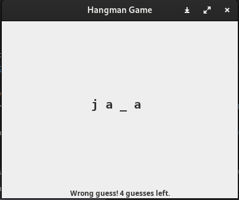
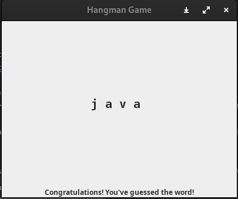

# Hangman Game GUI

Hangman is a classic guessing game for two players. In this GUI-based version, one player enters a secret word, and the second player tries to guess it by suggesting letters, using a graphical interface instead of the console.

## Implementation

Implementation of the Hangman game using Java Swing to create a graphical user interface (GUI). Here are the key features of the GUI version:
* The game starts by prompting the first player to enter a secret word through a dialog box.
* The word is stored internally, and the game screen shows blanks for each letter.
* Players use the keyboard to input their guesses.
* The GUI updates to reveal any correctly guessed letters in their respective positions.
* The game tracks and displays the number of incorrect guesses left.
* The game ends and displays a message when the player guesses the word correctly or exhausts the allowed wrong guesses.

## Example GUI Flow

1. **Start Screen:**
    - Prompt to enter the secret word in a dialog box.
    - 

2. **Gameplay Screen:**
    - Display the progress with underscores representing each letter of the word.
    - Allow the player to press keyboard keys to guess letters.
    - Update the display to show correct guesses and remaining wrong guesses.
    - 

3. **End of Game:**
    - Show a message dialog stating "Congratulations! You've guessed the word: [word]" if the player wins.
    - Show a message dialog stating "Game over! The correct word was: [word]" if the player loses.
    - 


## Running the Game

To run the Hangman GUI game:
1. Clone the repository: <br>
``` git clone https://github.com/ahmedeladl00/Hangman-Game-Java-Swing.git```
2. Compile the Java files from your terminal: <br>
```javac HangmanGUI.java```
3. Execute the game: <br>
```java HangmanGUI```

Feel free to download and try out the game, and consider contributing improvements or reporting issues!
